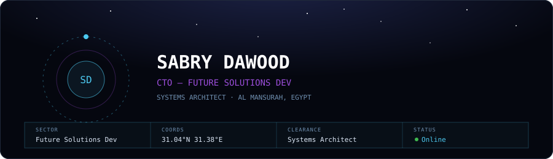

  

 

## `01` SYSTEMS ONLINE

**Active**

**Archived**

 

## `02` MISSION MODULES

**MOD-01 · est8core**
Multi-tenant real estate SaaS platform (subdomain architecture). Dynamic SQL builder for contract queries, chunked file uploads, bilingual AR/EN design system.
`multi-tenant` `saas`

**MOD-02 · future-audio-intelligence**
npm package for audio transcription and summarization. Swappable provider adapters (Deepgram, Whisper, OpenRouter, Gemini) with JSON/SQLite/S3 storage backends.
`npm` `adapter pattern` — [repo](https://github.com/FutureSolutionDev/future-audio-intelligence)

**MOD-03 · deploy-center**
Custom CI/CD orchestration tool for internal deployment pipelines.
`ci/cd` `internal` — [repo](https://github.com/FutureSolutionDev/Deploy-Center-Server)

 

## `03` R&D

*Experimental — not production modules.*

**LAB-01 · nano-gpt-ts** — `IN DEVELOPMENT`
GPT built from scratch in pure TypeScript — custom autograd engine, causal self-attention, Adam optimizer. Formal four-stage training pipeline spec.

**LAB-02 · agent-builder** — `DESIGN PHASE`
White-label multi-tenant AI agent platform concept — WhatsApp-first channel, multi-LLM provider support, per-client guardrails.

 

## `04` OPERATING DOCTRINE

> Structured abstraction layers — repositories, helpers, base classes
> Heavy SQL performance optimization
> Native TypeScript stack — no Python in core logic
> Design tokens over hardcoded values — no inline hex
> Adapter / Ports & Adapters pattern for swappable providers

 

## `05` TELEMETRY

  
  

 

## `06` ORBITAL ACTIVITY

  

 

## TRANSMIT

  
  
  

